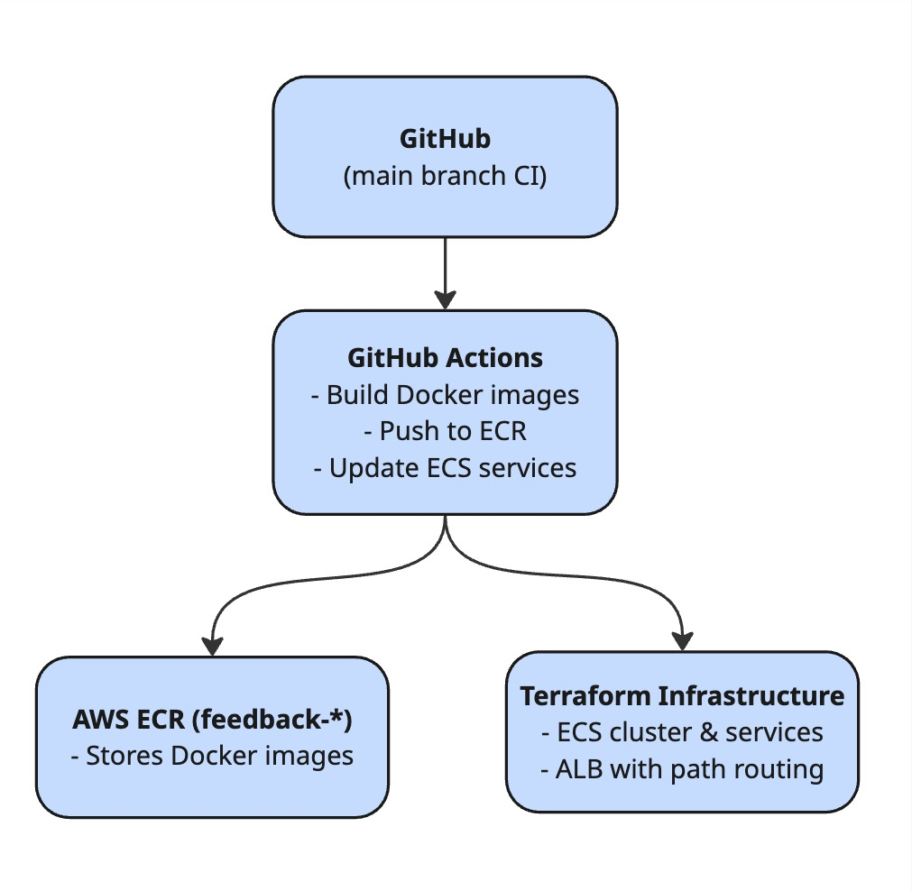
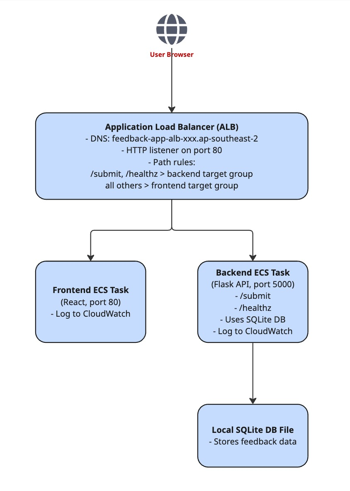

# Feedback App: CI/CD Deployment with GitHub Actions and AWS ECS

## Project Overview

This project is a full-stack feedback collection application designed to demonstrate CI/CD automation using GitHub Actions and infrastructure provisioning with Terraform. The application consists of:

* **Frontend**: A React application built with Vite
* **Backend**: A Flask API connected to a local SQLite database
* **Cloud Hosting**: AWS ECS with Fargate, Application Load Balancer, and ECR
* **CI/CD**: GitHub Actions for automated testing, Docker image builds, ECR pushes, and ECS deployments

The live site can be found here: http://feedback-app-alb-128255988.ap-southeast-2.elb.amazonaws.com/

## Purpose

This project was developed for the DEV1004 - DevOps course Assessment 3 to showcase:

* Automation of build, test, and deployment pipelines
* Containerised deployment using Docker
* Infrastructure as Code using Terraform
* Cloud deployment to AWS ECS with ALB and path-based routing

## CI/CD Tools and Systems

### GitHub Actions

GitHub Actions was chosen as the CI/CD platform due to its seamless integration with GitHub repositories, built-in support for Docker, and ability to integrate AWS deployment via community-supported actions.

**Workflow Features:**

* Triggered on push to the `main` branch
* Builds backend and frontend Docker images (for `linux/amd64`)
* Pushes images to Amazon ECR
* Triggers ECS service deployments using `force-new-deployment`

## CI/CD Workflow Explanation

The GitHub Actions workflow automates the entire deployment pipeline for this application.

**Purpose:**  
To ensure that every code push to `main` results in a clean, tested, and reliably deployed version of the app.

**What it does:**

1. **Checkout the code**  
   Retrieves the latest version of the app source code.

2. **Set up Python**  
   Required for running backend tests using `unittest`.

3. **Install and run tests**  
   Runs a suite of Flask API tests and stores results as an artifact (`test_results.log`) to ensure the API behaves as expected.

4. **Build Docker images (backend + frontend)**  
   Images are tagged with the Git SHA to preserve revision history in Amazon ECR.

5. **Push images to ECR**  
   Makes new builds available to ECS.

6. **Trigger ECS redeploy**  
   Uses `aws ecs update-service --force-new-deployment` to pull the new image without modifying the task definition directly.

7. **Upload the deployed workflow**  
   Exports the active workflow file as a downloadable artifact for traceability.

This workflow ensures reproducibility and visibility across all stages of the pipeline.

### Workflow Triggers

The GitHub Actions workflow is configured to run under multiple conditions:

- On push to the `main` branch
- On pull requests targeting `main` (e.g. when opened or updated)
- On a daily schedule via cron (3:00 AM UTC)

```yaml
on:
  push:
    branches: [ main ]
  pull_request:
    branches: [ main ]
    types: [opened, synchronize, reopened]
  schedule:
    - cron: '0 3 * * *'

jobs:
  deploy:
    if: github.event_name == 'push'
    runs-on: ubuntu-latest
    steps:
      - Checkout code
      - Configure AWS credentials
      - Login to Amazon ECR
      - Build backend and frontend Docker images
      - Push both images to ECR
      - Force ECS to redeploy backend and frontend services
```
### Workflow Artifacts

To support traceability and quality assurance:

- The test results (`test_results.log`) from the backend test suite are stored as a GitHub Actions artifact on every run.
- The active CI/CD workflow file (`ci-cd.yml`) is uploaded with each deployment to capture exactly what automation logic was used.

These artifacts provide a persistent record of each pipeline execution, satisfying audit and rollback needs in a professional setting.

## Infrastructure with Terraform

Terraform provisions all required cloud infrastructure:

* **ECR Repositories**: `feedback-app-backend`, `feedback-app-frontend`
* **ECS Cluster**: Named `feedback-app-cluster`
* **Task Definitions**: For backend and frontend, each running a single container
* **Application Load Balancer**: Routes `/submit` and `/healthz` to the backend, and all other traffic to the frontend
* **Security Groups**: One for ALB, one for ECS tasks
* **CloudWatch Logs**: For backend and frontend logging

### Path-Based Routing

* `http://<alb-dns>/submit` and `/healthz` → Flask backend
* `http://<alb-dns>/` → React frontend

## Application Functionality

### Frontend

* Built with Vite and React 19.1
* Collects name and comment from user
* Sends POST request to backend via ALB at `/submit`

### Backend

* Flask app with `/submit` and `/healthz` endpoints
* Writes feedback to local SQLite database
* Logs actions to CloudWatch

## Testing

Backend includes unit tests using `unittest`, run in CI pipeline:

* `/healthz` responds with status `200`
* `/submit` handles valid and invalid JSON input

## Technologies Used

* **React (Vite)**: Frontend
* **Flask**: Backend API
* **SQLite**: Local database
* **Docker**: Containerization
* **GitHub Actions**: CI/CD automation
* **Terraform**: Infrastructure as Code
* **AWS ECS + ALB + ECR**: Cloud deployment

## Technology Relationships and Dependencies

This application is powered by a tightly integrated CI/CD and cloud infrastructure stack:

- **GitHub Actions** runs the CI/CD workflow and serves as the entry point into the deployment pipeline.
- **Terraform** provisions all AWS infrastructure (ECS cluster, ALB, security groups, etc.) and ensures that services like ECS and ALB are available and configured before deployments occur.
- **Docker** is used to package both the frontend and backend applications, ensuring consistency between local and cloud environments.
- **Amazon ECR** stores these Docker images and is accessed both by GitHub Actions (for pushing) and ECS (for pulling images).
- **Amazon ECS (Fargate)** runs the containers as tasks and services. It retrieves the correct image from ECR and logs output to **CloudWatch**.
- The **Application Load Balancer (ALB)** sits in front of ECS and routes user traffic based on path: `/` to the frontend, `/submit` to the backend.

The GitHub Actions workflow pushes images to ECR and then triggers ECS to deploy new versions of those containers. ECS cannot run new containers without the infrastructure Terraform has provisioned, and Terraform relies on well-defined Docker images to bind into ECS task definitions. This creates a shared responsibility between provisioning (Terraform) and delivery (GitHub Actions).

## Comparison to Alternatives

Several tools were considered when designing this stack:

- **Terraform vs. AWS Console or CloudFormation**:  
  Terraform was chosen because it is more readable, works cross-cloud, and integrates well with version control. CloudFormation is AWS-native but more verbose and harder to test. The AWS Console was avoided to maintain reproducibility.

- **GitHub Actions vs. Jenkins or GitLab CI**:  
  GitHub Actions was chosen for its native integration with the repo, minimal setup, and excellent AWS support. Jenkins would require infrastructure setup and management. GitLab CI would require migration of the codebase to GitLab.

- **Amazon ECS vs. EC2 or App Runner**:  
  ECS Fargate provides serverless container orchestration with no need to manage VMs. EC2 would add operational overhead, and App Runner (though easier) offers less granular control over networking and container config.

This setup reflects real-world DevOps practices where infrastructure is declarative (Terraform), deployment is automated (GitHub Actions), and services are modular and independently scalable (ECS containers).

## Feedback App Diagrams

### Deployment Pipeline


### Runtime Flow


## Setup and Usage

### Local Development

```bash
# Backend
cd backend
python -m venv venv && source venv/bin/activate
pip install -r requirements.txt
python app.py

# Frontend
cd feedback-dashboard
npm install
npm run dev
```

### Docker Compose (Local Dev)

```bash
docker-compose up --build
```

### Deploy to AWS

```bash
cd infra
terraform init
terraform apply
```

Push to `main` branch triggers CI/CD:

```bash
git add .
git commit -m "Your message"
git push
```

## Author

Chris Apps
